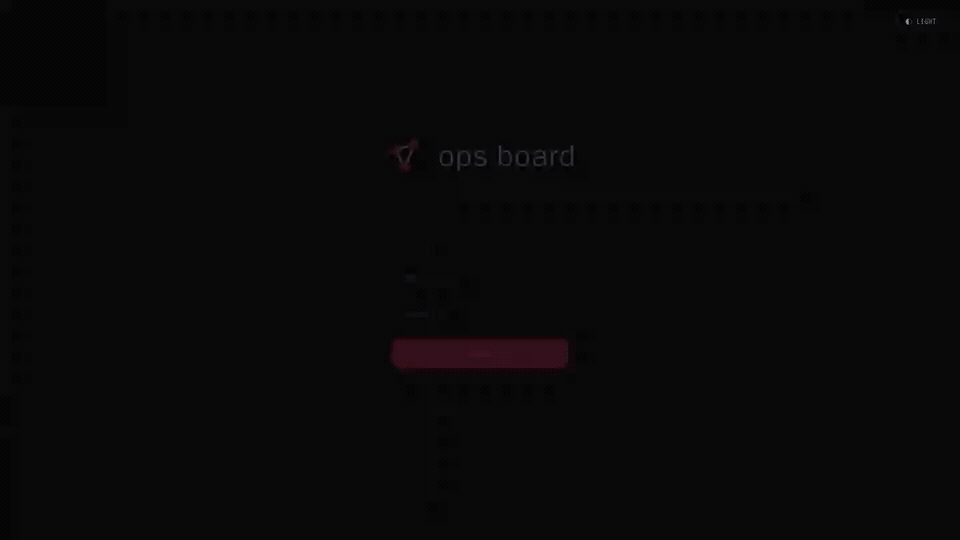

# ops-board

**ops-board** is a shared, live graph for running a red team operation, not for drawing it up afterward. I wanted a single place where the whole engagement stays visible while it is still moving: every discovery kept, every loose end still on the board, nothing dropped just because the operation went somewhere else.

The reason is that attackers think in graphs when they analyze the target, but run the operation like a checklist. Anything that doesn't fit the current step gets set aside. You find a host on day 1, collect a credential on day 3, and only on day 10 realize the two are connected. By then the context is gone, buried in notes or rebuilt from memory under pressure.

On the board, every host, identity, credential, finding, and open question is a node carrying where it currently sits, and each edge describes a relationship: confirmed, hypothetical, blocked, or attempted and interrupted. The picture fills in as the engagement moves. It runs locally or deployed, with authentication and real-time sharing built in.

I looked for a tool that did this, didn't find one, and built it. The full reasoning is [in this post](https://brmk.me/posts/obsessed-with-graphs).

<details>
<summary>DEMO</summary>



</details>

## quick start

```bash
docker-compose up -d --build
```

Open `http://localhost:8080`.

On the very first start, when no users exist yet, the API automatically creates an `admin` account with a randomly generated password. The credentials are printed to the container logs:

```
============================================================
  FIRST LAUNCH — admin account created
  username : admin
  password : <generated>
  Change these credentials after your first login.
============================================================
```

Run `docker-compose logs api` if you need to retrieve them. After logging in, use the admin panel to create additional accounts or change the password.

Data persists in `./data/` — removing that directory resets both graphs and users.

### custom initial credentials

Set `OPSBOARD_INIT_USER` and `OPSBOARD_INIT_PASSWORD` before the first launch to override the auto-generated admin account:

### configuration

| Env var | Default | Purpose |
| --- | --- | --- |
| `OPSBOARD_SECRET` | *(auto-generated)* | JWT signing key. If unset (or left as the compose placeholder) a persistent random secret is generated under `./data/.secret`. Set it explicitly in production. |
| `OPSBOARD_TOKEN_HOURS` | `8` | Token lifetime. |
| `OPSBOARD_ALLOW_REGISTER` | `false` | Enable the public `/api/auth/register` endpoint. |
| `OPSBOARD_INIT_USER` / `OPSBOARD_INIT_PASSWORD` | — | Override the auto-generated first admin. |
| `OPSBOARD_CORS_ORIGINS` | *(none)* | Comma-separated list of allowed cross-origin origins. Only needed for local dev against a separate frontend dev server — front and API share one origin behind nginx in production. |

## stack

- **Frontend:** React 18, XyFlow, Zustand, Tailwind CSS
- **Backend:** FastAPI, Python 3.12
- **Deploy:** Docker Compose (two containers, one port)

## tests

API tests run inside the api image (no local Python toolchain needed):

```bash
docker compose build api
docker compose run --rm --no-deps -v "$PWD/api:/app" api \
  sh -c "pip install -q pytest httpx && cd /app && python -m pytest -q"
```
